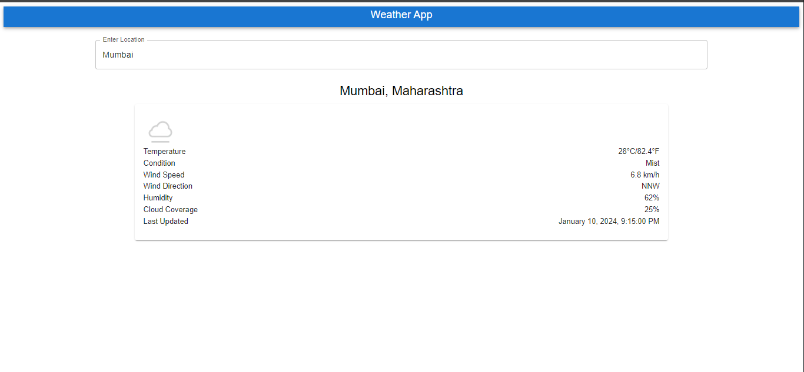

# WeatherApp

An App based on React to show current weather details of any place

## Table of Contents

- [Installation](#installation)
- [Usage](#usage)
- [Contact](#contact)

## Installation

1. Clone the repository:

```bash
git clone https://github.com/TST14/WeatherApp.git
```

2. Go to Folder

```bash
   cd .\weather-app\
```

3. Install Dependencies:

```bash
   npm install
```

4. Run the app

```bash
   npm start
```

## Usage



## Contact

For inquiries, contact [TANMAY SINGH THAKUR](mailto:thakurtanmaysingh@gmail.com).
